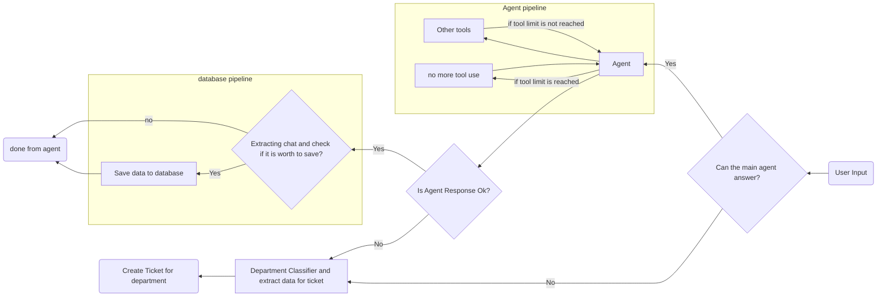

**QA‑Agent** was my fourth project during the MHS internship. The goal was to build an intelligent agent that understands user questions and either answers them directly or intelligently escalates to a human support team when necessary.

The project is organized into three components:

- **agent‑core** – The brain of the system. Developed entirely with LangGraph and LangChain, this folder contains the full conversational graph and tool orchestration, following the architecture below.

- **agent‑full** – A lightweight backend (built with FastAPI) wrapped around the core agent, paired with a simple, clean frontend that brings the agent to life for end users.

- **Presentation.ipynb** – A notebook that walks through the design and development process of the agent's core, originally created for a university presentation.

> *If you're looking for a deeper technical dive, the diagram below (the same one used in the main README) maps the exact decision flow that powers every conversation.*

This structure keeps the focus on the technical achievement while making the text welcoming and mistake‑free. You can place it in your README as a project overview, or use it wherever you need to introduce the work.
